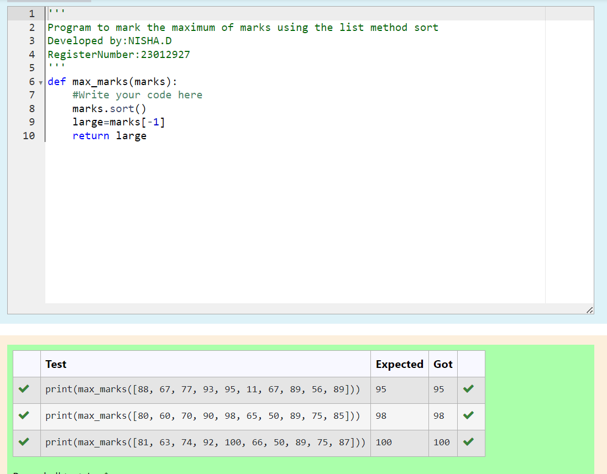
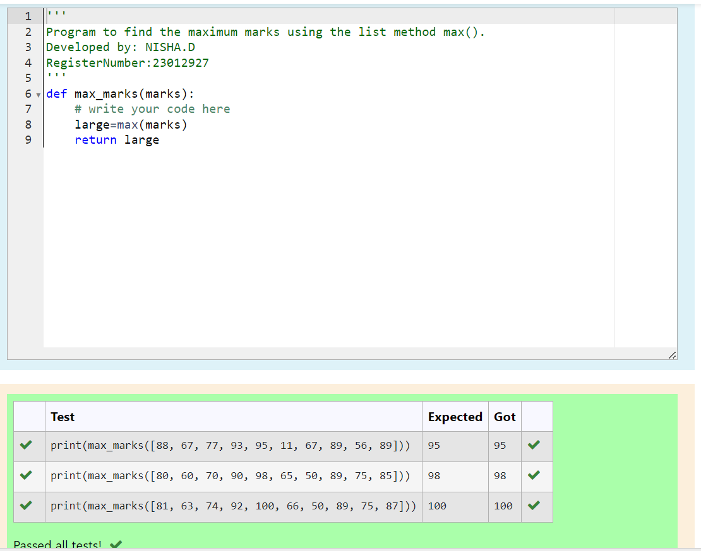
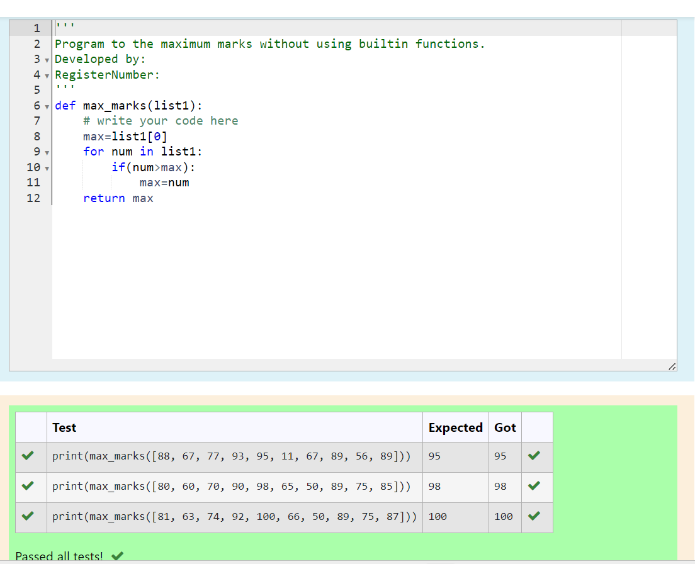

# Find the maximum of a list of numbers
## Aim:
To write a program to find the maximum of a list of numbers.
## Equipment’s required:
1.	Hardware – PCs
2.	Anaconda – Python 3.7 Installation / Moodle-Code Runner
## Algorithm:
1.	Get the list of marks as input
2.	Use the sort() function or max() function or use the for loop to find the maximum mark.
3.	Return the maximum value
## Program:

i)	# To find the maximum of marks using the list method sort.
```Python
Developed by:NISHA.D 
RegisterNumber:23012927 
def max_marks(marks):
    #Write your code here
    marks.sort()
    large=marks[-1]
    return large


```

ii)	# To find the maximum marks using the list method max().
```Python
Developed by:NISHA.D 
RegisterNumber:23012927 
def max_marks(marks):
    # write your code here
    large=max(marks)
    return large


```

iii) # To find the maximum marks without using builtin functions.
```Python
Developed by:NISHA.D 
RegisterNumber:23012927 
def max_marks(list1):
    # write your code here
    max=list1[0]
    for num in list1:
        if(num>max):
            max=num
    return max


```
## Sample Input and Output

 

## Output:
# To find the maximum of marks using the list method sort.




# To find the maximum marks using the list method max().




# To find the maximum marks without using builtin functions.





## Result:
Thus the program to find the maximum of given numbers from the list is written and verified using python programming.
